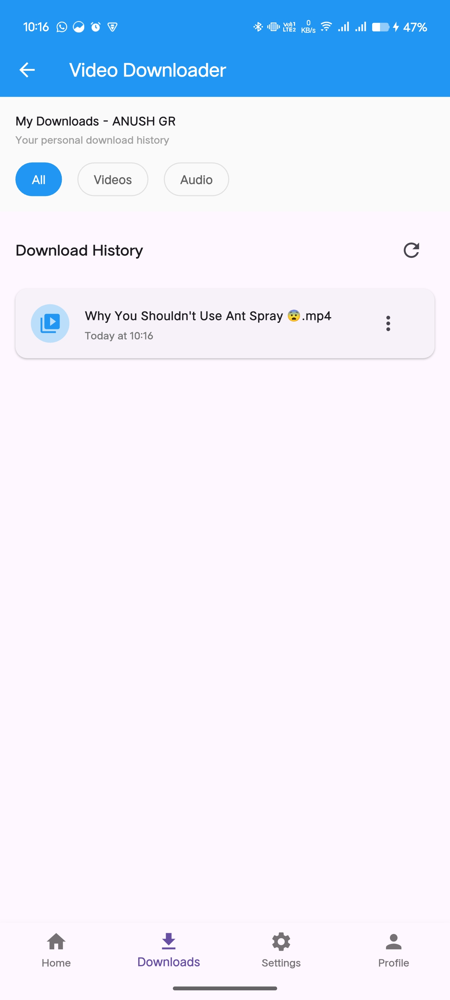

# Flutter Video Downloader App

A simple Flutter application that allows users to download videos using a backend powered by **yt-dlp**, **FFmpeg**, and **Flask**. The app sends a URL to the backend, processes it through yt-dlp, optionally converts or compresses using FFmpeg, and returns the final file to the device.

---

## Features

* Download videos from supported platforms using yt-dlp
* Backend processing with Flask
* Optional video conversion/compression with FFmpeg
* Clean and minimal Flutter UI

---

## Screenshots

### Screenshot 1


### Screenshot 2



### Screenshot 3


### Screenshot 4


### Screenshot 5


### Screenshot 6


---

## Tech Stack

### Frontend (Flutter)

* Dart + Flutter
* HTTP communication with backend
* Material UI components

### Backend (Flask)

* Python Flask REST API
* yt-dlp for video extraction
* FFmpeg for processing (conversion, trimming, etc.)

---

## Project Structure

```
Flutter-APP/
│
├── lib/
│   ├── main.dart
│   ├── screens/
│   ├── widgets/
│   └── services/
│
├── backend/
│   ├── app.py
│   └── requirements.txt
│
│
└── README.md
```

---

## Backend Setup

1. Install dependencies:

```
pip install -r requirements.txt
```

2. Make sure **yt-dlp** is installed:

```
pip install yt-dlp
```

3. Ensure FFmpeg is installed and available in PATH.

4. Start the Flask server:

```
python app.py
```

---

## Flutter Setup

1. Install dependencies:

```
flutter pub get
```

2. Run the application:

```
flutter run
```

3. Make sure the API URL inside your Flutter code points to your Flask server.

---

## API Overview

```
POST /download
Body:
{
  "url": "<video_url>"
}

Response:
Binary video file
```
